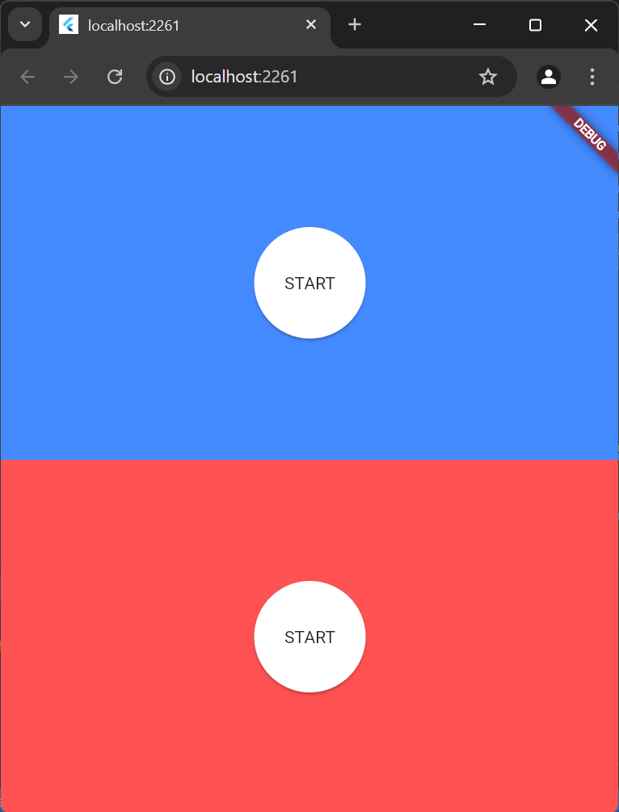
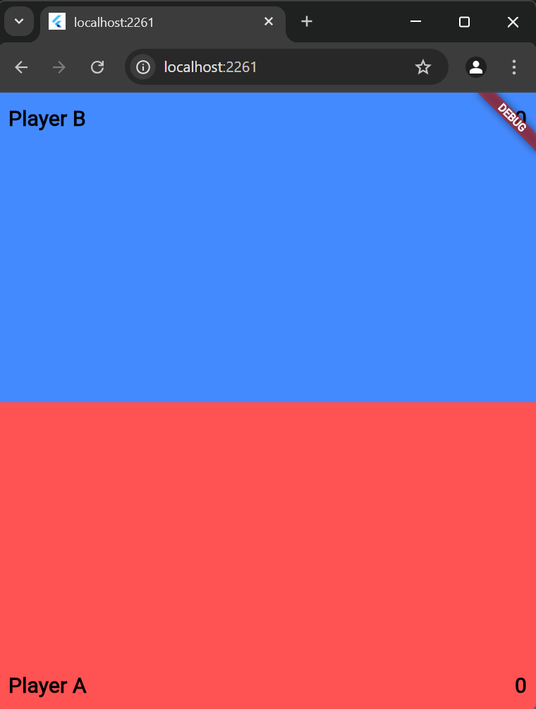
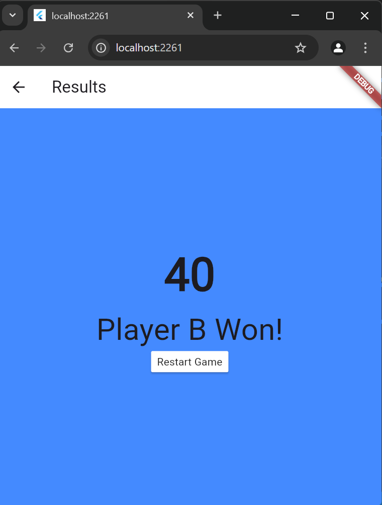

# Finger Tapping Game

A fun and competitive multiplayer game built using Flutter! Two players compete to fill the screen with their respective color—Red (Player A) or Blue (Player B). The player who fills the screen first wins!

## 📌 How to Play
1. Player A taps to increase the red color.
2. Player B taps to increase the blue color.
3. Each tap reduces the opponent's color proportionally.
4. The game continues until one player fills the entire screen with their color.
5. The first player to achieve full coverage wins!

## 🚀 Features
- Simple and engaging gameplay.
- Multiplayer on a single device.
- Dynamic color-changing mechanics.
- Fast-paced and competitive.

## 🛠️ Technologies Used
- Flutter (Dart)
- Flutter Gesture Detection
- State Management (setState / Provider / Riverpod - depending on what you used)

## 📷 Screenshots
### Main page


### Game Page


### Result Page



## 🏗️ Built With  
- Flutter  
- Dart

## ✅ Prerequisites
Before running this project, ensure you have the following installed:

- Flutter SDK
- Dart (comes with Flutter)
- Android Studio or Visual Studio Code (with Flutter extension)
- A connected device or an emulator (Android/iOS)


## 📥 Installation
1. Clone the repository:
   ```sh
   git clone https://github.com/Mrghost077/Finger-Tap-Game.git
   ```
2. Navigate to the project directory:
   ```sh
   cd Finger-Tap-Game
   ```
3. Install dependencies:
   ```sh
   flutter pub get
   ```
4. Run the app:
   ```sh
   flutter run
   ```

## 🎮 Controls
- Tap anywhere on your side of the screen to increase your color.
- Be faster than your opponent to win!

## 📌 Future Improvements
- Online multiplayer mode.
- Power-ups and obstacles.
- Customizable themes and colors.

## 📜 License
This project is licensed under the MIT License.

## 👥 Contributors
- Safwan (@mrghost077)

## Contributing
Pull requests are welcome. For major changes, please open an issue first to discuss what you would like to change.

Enjoy the game and challenge your friends! 🎉